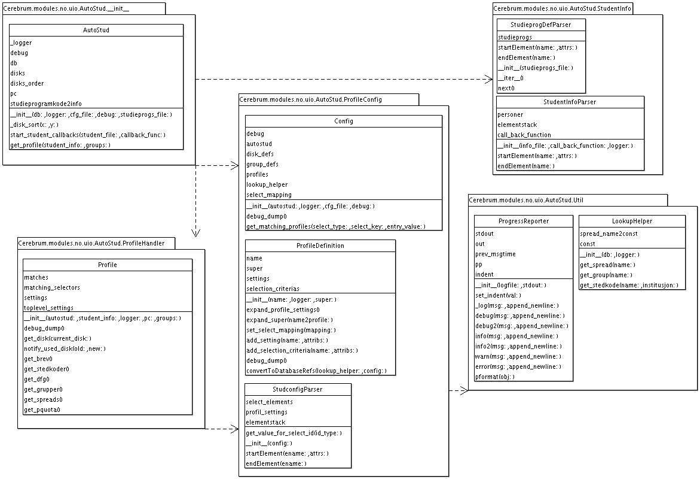

=======================================================
Automatic useradministration in Cerebrum
=======================================================

Technical details
==================

Most of the routines for automatic student administration in Cerebrum
are handled by ``Cerebrum.modules.no.uio.AutoStud``.  Typical usage is
something like::

    autostud = AutoStud.AutoStud(db, logger, debug=debug, cfg_file=studconfig_file,
                                 studieprogs_file=studieprogs_file)
    autostud.start_student_callbacks(student_info_file,
                                     process_students_callback)
    def process_students_callback(person_info):
        profile = autostud.get_profile(person_info)
        print "Disk: %s" % profile.get_disk()

The ``cfg_file`` is an XML file that contains rules defining
properties of a students account.  ``studieprogs_file`` is an XML file
describing the various "studieprogrammer", and ``student_info_file``
is the ``merged_persons.xml`` file generated from FS data.  The
classes in ``AutoStud`` are:

 * ``AutoStud.AutoStud`` is the main class, and is normally the only
   one you would initialize.
 * ``Util.ProgressReporter`` is an alternative to ``logging.py``, and
   should probably be replaced by that module.
 * ``Util.LookupHelper`` contains various helper functions for
   DB-lookup
 * ``ProfileConfig.Config`` parses the ``studconfig.xml`` file and
   stores it internaly
 * ``ProfileConfig.ProfileDefinition`` internal class that stores data
   about a spesific profile
 * ``ProfileConfig.StudconfigParser`` is the actual XML parser for the
   ``studconfig.xml`` file.
 * ``ProfileHandler.Profile`` contains logic that expands the actual
   profile matches to the disk, groups etc. that a user should have.
 * ``Studentinfo.StudentInfoParser`` is a XML parser for the
   ``merged_persons.xml`` file.
 * ``Studentinfo.StudieprogDefParser`` is a XML parser for the file
   with "studieprogrammer".

The figure belo shows a schematic view of the classes (should be UML,
but the author is no UML expert).  It should give you a rough idea
about where things are implemeted.

.. _class_overview :

Figure: Class overview

Studconfig.xml file
=====================
The file ``studconfig.xml`` controls how the automated student
maintenance is performed.  It defines a list of profiles containing
attributes for accounts as well as select criterias reuired to match
the profile.

`Example <autoconfig-student-eksempel.xml>`_

After editing ``studconfig.xml``, you should validate it against
``studconfig.dtd`` using an XML parser.  In emacs with psgml-mode,
simply press ``Ctrl-c Ctrl-p`` to load the DTD, and ``Ctrl-c Ctrl-o``
to jump to next error.

`DTD <studconfig_dtd.xml>`_

